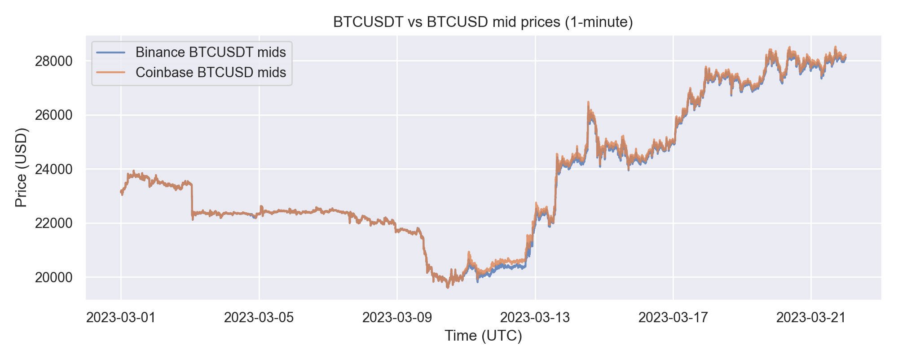
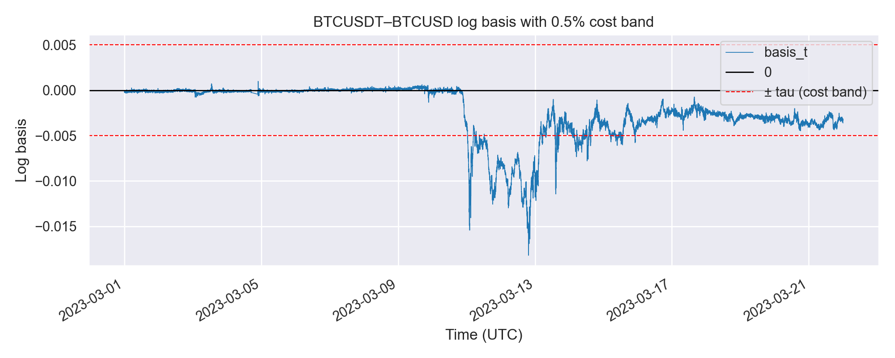
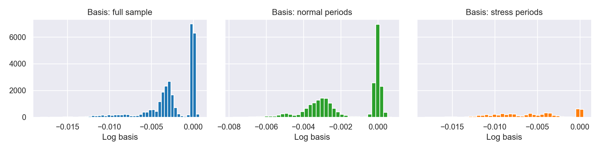
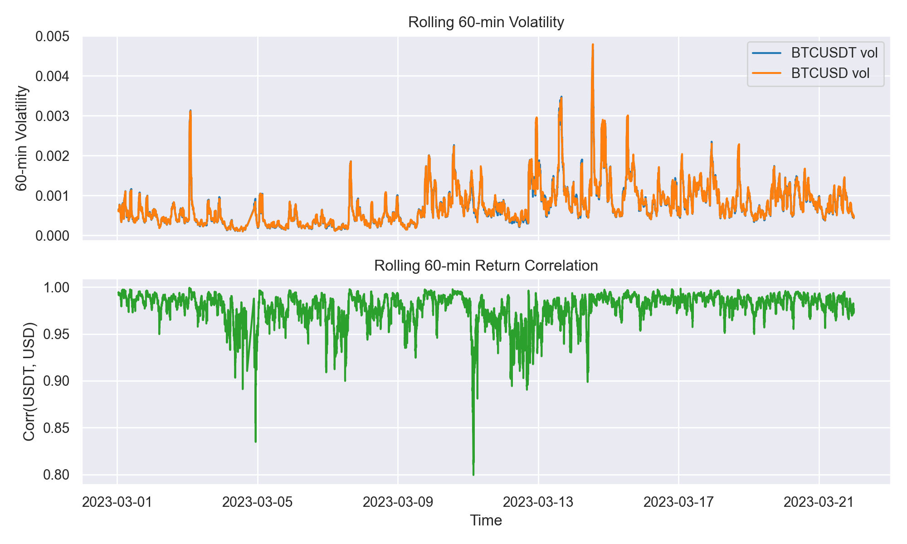
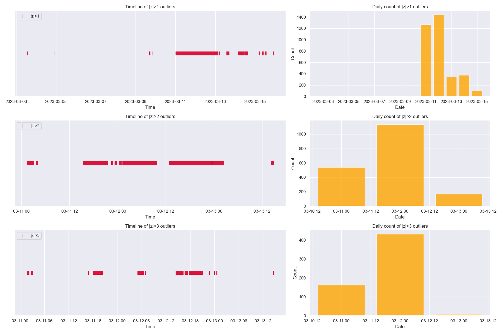
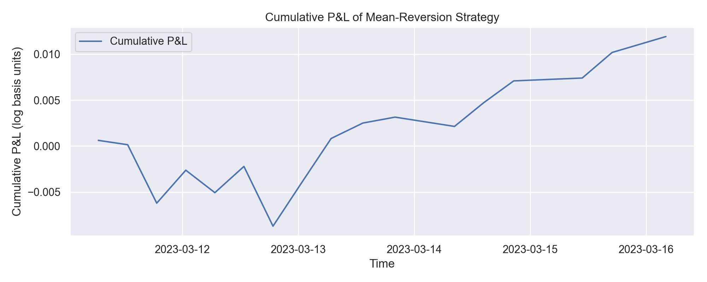

# IAQF 2026 — Q1: Cross-Currency Basis in BTC Markets

**International Association for Quantitative Finance (IAQF) Annual Student Competition**

> Bitcoin trades simultaneously on dozens of exchanges, quoted in different currencies. We study a subtle but consequential question: *does it matter whether you buy BTC with real US dollars or with USDT, a dollar-pegged stablecoin?* The short answer is yes — and the gap widens sharply in times of stress.

📄 **[Full paper: report.pdf](report.pdf)**  
📓 **[Analysis notebook: notebooks/Q1_cross_currency_basis.ipynb](notebooks/Q1_cross_currency_basis.ipynb)**

---

## The Competition

The [IAQF Annual Academic Competition](https://iaqf.org/) challenges student teams to tackle live problems in quantitative finance. The 2026 edition focuses on cryptocurrency market microstructure and cross-asset dynamics across regulated and unregulated venues.

**Our question (Q1):** Measure and explain the *cross-currency basis* — the price difference between BTC quoted in USDT on Binance (the world's largest crypto exchange, offshore) and BTC quoted in USD on Coinbase (the largest US-regulated exchange) — over a 21-day window that includes the March 2023 banking and stablecoin crisis.

---

## The Story

When Silicon Valley Bank failed on March 10, 2023, it triggered a brief de-pegging of USDC (a major stablecoin). Even though Tether (USDT) held its peg, *all* crypto-dollars traded at a discount to real bank dollars. This shows up clearly in BTC prices:

- **Normal times:** BTC costs ~0.24% more on Coinbase (USD) than Binance (USDT) — a small but persistent premium for regulated, bank-settled dollars
- **March 10–13 stress:** That gap widened to ~1.5% and stayed wide for hours

Why didn't arbitrageurs close it instantly? Because moving capital between a US-regulated venue and an offshore exchange is slow, costly, and especially risky during a crisis. The gap represents real, measurable *funding risk* built into the USDT/USD spread.

---

## Key Results

| Metric | Value |
|---|---|
| Mean log basis (USDT − USD) | **−0.24%** (USDT persistently cheaper) |
| Peak basis during March 10–13 | **~−1.5%** |
| AR(1) half-life of the basis | **~7.5 hours** — dislocations are slow to mean-revert |
| Minutes exceeding 0.5% cost band | **13.3%** — and 100% one-sided (always USDT discount) |
| Price discovery leader | **Binance** (60% Hasbrouck information share) |

The one-sidedness is striking: BTCUSDT is *never* rich enough relative to BTCUSD to justify a trade in the other direction. Arbitrage is constrained, directional, and regime-dependent.

---

## Figures

| | |
|---|---|
|  |  |
|  |  |
|  |  |

---

## Quick Start

```bash
python -m venv .venv && source .venv/bin/activate
pip install -r requirements.txt
jupyter notebook notebooks/Q1_cross_currency_basis.ipynb
```

To re-download Coinbase data:
```bash
python -m src.download_coinbase_candles
```

---

## Repository Layout

```
├── report.pdf                  # Full competition paper
├── notebooks/
│   └── Q1_cross_currency_basis.ipynb   # All analysis, tables, and plots
├── src/
│   └── download_coinbase_candles.py    # Coinbase REST API downloader
├── data/
│   ├── raw/                    # 1-min OHLCV candles (Binance & Coinbase)
│   └── processed/              # Cleaned and aligned datasets
├── figures/                    # All output charts (auto-generated by notebook)
├── tests/                      # Data integrity tests
└── requirements.txt
```

---

## Methodology (brief)

- **Data:** 1-minute OHLCV candles for BTCUSDT (Binance) and BTCUSD (Coinbase), March 1–21, 2023 — ~29,950 aligned observations after cleaning.
- **Basis:** Log price difference $b_t = \log P^{USDT}_t - \log P^{USD}_t$. Negative = USDT cheaper.
- **Transaction-cost band:** Symmetric round-trip fee of ±0.5% (Binance 0.10% + Coinbase 0.40%).
- **Persistence:** AR(1) model with regime-specific half-lives; ADF/KPSS stationarity tests.
- **Drivers:** OLS with HAC (Newey–West) standard errors — stress dummy, realized volatility, volume, lagged basis.
- **Cointegration & price discovery:** Johansen trace test, VECM, Hasbrouck (1995) information shares, Granger causality.

---

*IAQF Annual Academic Student Competition 2026.*
